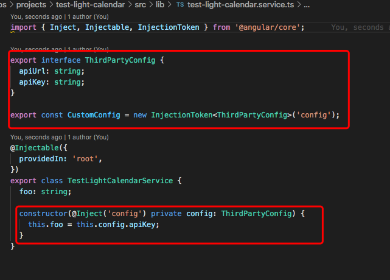
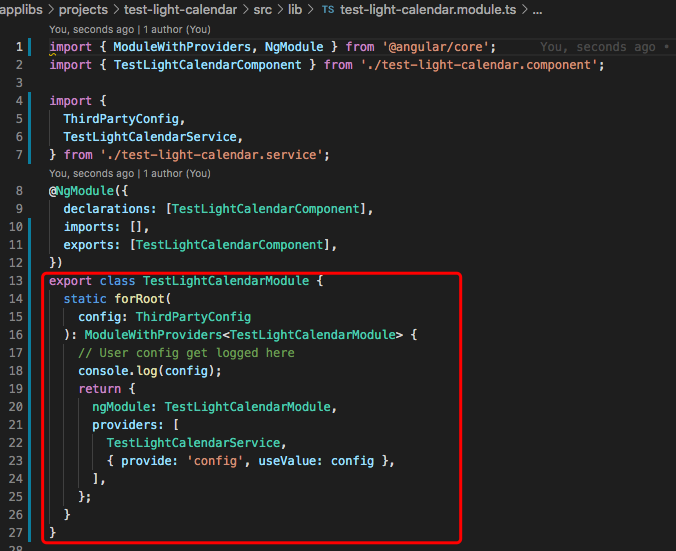
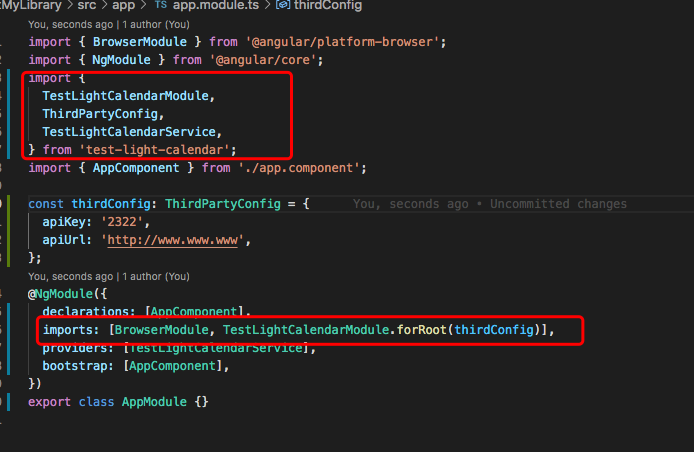

## publish a library on NPM

- ng new applibs --createApplication=false
- cd applibs
- ng generate library testLightCalendar
- file folder structure
  - applibs
    - projects
      - test-light-calendar
        - src
          - public-api.ts
- ng build testLightCalendar --prod
  - without [--prod] option, when you publish you libray ,you will encounter a publish error "Trying to publish a package that has been compiled by Ivy"
- cd dist
- cd test-light-calendar
- npm login
- npm publish
  - when you publish the package the second time
  - npm version patch | minor |..
  - npm publish

## consumed this library in other angular app.

- npm i test-light-calendar
- app.module.ts
  - import { TestLightCalendarModule } from 'test-light-calendar';
  - @NgModule({
    imports: [ TestLightCalendarModule]
- in component
  - .html, use selector
  - <lib-testLightCalendar></lib-testLightCalendar>

## we can pass parameters to module using forRoot

- add Inject in service.ts
  - 
- add static forRoot in module.ts

  - 

- when we consume the library, use moduleName.forRoot({..}) in app.module.ts
  - 

## proofs

